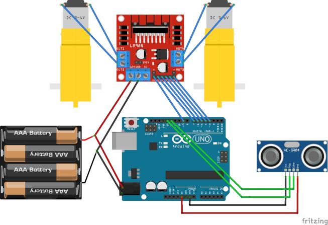

# Önsöz

Bu rapor Sistem Analizi ve Tasarımı dersi kapsamında yapmış olduğum engelden kaçan robot projesi için hazırlanmıştır. Kullanılan parçalar belirtilmiş, her bir modül için bağlantı şemaları ve genel kullanım örnekleri verilmiştir. Son olarakta projenin şeması ve Arduino' ya yükleyeceğimiz kod verilmiştir. Bu projede geliştirme ortamı olarak VS Code - PlatformIO kullanılmıştır.
<div class="page"/>

## Kullanılan parçalar
* Arduino Uno
* 2WD Araç Platformu
* HC-SR04 Ultrasonik Mesafe Sensörü
* L298N DC/Step Motor Sürücü
* 4 Adet AA Pil
* Jumper Kablo

<br />  


## Motor Sürücü Bağlantısı 

IN1 ile IN2 pinleri sol motor, IN3 ile IN4 pinleri sağ motor bağlantısı için kullanılmaktadır. Bunlar motorun dönme yönünü belirler. ENA ve ENB pinleri motor hızı için kullanılacaktır. Pilin artı tarafı L298N 12V pinine, eksi tarafı ise GND pinine bağlanmıştır. Arduinonun da bağlantı sağlaması için her iki kartın GND pinleride birbirine bağlanmıştır. Örnek olarak sağ motorun basitçe çalışma prensibi şu şekildedir: 

  
<div class="page"/>

```cpp
#include <Arduino.h>

// pinleri tanımlıyoruz
byte sol1 = 7;
byte sol2 = 6;
byte sag1 = 5;
byte sag2 = 4;

void setup()
{
    // çıkış pini olduklarını belirtiyoruz
    pinMode(sol1, OUTPUT);
    pinMode(sol2, OUTPUT);
    pinMode(sag1, OUTPUT);
    pinMode(sag2, OUTPUT);
    
    // burda yaptığımız şey in1 0, in2 1 olarak tanımlamak. bu sayede motor sola döğru hareket eder
    // sağa doğru dönmesi için de in1 1, in2 0 olarak tanımlanır.
    digitalWrite(sol1, HIGH);
    digitalWrite(sol2, LOW);
}

void loop()
{

}
```
  
Tek bir motor için kodlar yukarıdaki gibi olacaktır. Projenin geri kalanında motorların hızını da kontrol edeceğimiz için ENA ve ENB pinlerini de dahil edeceğiz. Bunlara analog sinyal göndermemiz gerektiğinden ENA için 3, ENB için 9 pinleri kullanılacaktır. 

<br />  

## HC_SR04 Ultrasonik Mesafe Sensörü Bağlantısı 

Bu sensörün VCC, TRIG, ECHO ve GND olmak üzere 4 pini vardır. VCC ve GND yi güç vermek için, sırasıyla Arduino' nun 5V ve GND pinlerine bağlayacağız. Haberleşme için de ECHO' yu 12, TRIG' i 13 pinlerine bağlıyoruz. TRIG bizim ses dalgalarını yollamasını söyleyeceğimiz, ECHO ise bu dalgalardan geri gelen ses dalgalarını okutacağımız pin. Mantık olarak ilk başta bir ses dalgası yollayacağız ve çarpıp gelen ses dalgalarını da okuyacağız. Arada geçen süre ile de mesafeyi hesaplayacağız. Biz projenin ilerleyen kısmında bu değerin, belli bir değerin altında olup olmadığını kontrol edecek ve ona göre işlem yapacağız. Örnek kod aşağıdaki gibi olacaktır.

 

```cpp
#include <Arduino.h>
// echo ve trig pinlerini tanımlıyoruz
byte echo = 12;
byte trig = 13; 
long sure, mesafe; // hesaplamada kullanacağımız değişkenleri tanımlıyoruz

void setup()
{
    pinMode(trig, OUTPUT); // ses dalgalarını yollayacağmız için çıkış pini
    pinMode(echo, INPUT);  // bize ses dalgaları geri geleceğinden giriş pini
    Serial.begin(9600); // değerleri görmek için seri monitör başlatıyoruz
}

void loop()
{
    digitalWrite(trig, LOW); // öncelikle pine giden sinyal varsa kesiyoruz
    delayMicroseconds(5); // 5 mikrosaniye bekliyoruz
    digitalWrite(trig, HIGH); // ses dalgası yolluyoruz
    delayMicroseconds(10); // 10 mikrosaniye bekliyoruz
    digitalWrite(trig, LOW); // ses dalgasını kesiyoruz

    sure = pulseIn(echo, HIGH) // echo pininden gelen dalgaları okuyoruz
    mesafe = (sure / 2) * 0.0343; // mesafeyi ölçmek için gereken hesaplama
    Serial.println(mesafe); // hesapladığımız değerleri seri monitöre gönderiyoruz.
}
```
  
Bu şekilde çalıştırdığımızda seri monitöre çok hızlı bir şekilde sayılar geldiğini görüyoruz. Bir cisim yaklaştığında bu değer küçülüyor, yakınlaştırdığımızda da değer artıyor. Yaptığımız hesaplamayla bu değer cm cinsinden gelmektedir. Şimdi bu değerlere göre motor hareketlerini düzenleyeceğiz.

<br />  

## Son Bağlantılar ve Algoritma

Son olarak yaptığımız bağlantıları birleştirecek, bunlara uygun algoritmayı yazacağız. Son bağlantı aşağıdaki gibi olacaktır.



Bu robot için 4 adet AA pil kullanıldı. Toplamda 6V elde ediyoruz ve bu devrenin çalışması için yeterli oluyor. Burda önemli olan nokta Motor Sürücünün güç bağlantısına Arduino' nunda aynı bağlantıdan dahil edilmesi. Bu sayede hem güç alabilecek hem de sürücüyü kontrol edebileceğiz.  

Robotun çalışması için mantıksal olarak 3 hareket tanımlayacağız; `ileri()`,  `geri()` ve  `sag()`. Robotun herhangi bir engelle karşılaşmadığı durumda `ileri()` fonksyonu her daim çalışacaktır. Bir engelle karşılaşıldığında, yani mesafe sensöründen okunan değerler belli bir değerin altına düştüğünde, önce `geri()` daha sonra da `sag()` fonksyonları çalışacaktır. Hareketlerin gerçekleşebilmesi için aralarında 500 ms olacaktır. 
<div class="page"/>

### ileri()

Her iki motorunda aynı yönde ve aynı hızda gitmesini içeren kodlardan oluşacaktır.

```cpp
digitalWrite(MotorSag1, LOW); // İleri yönde gitmesi için low ve high
digitalWrite(MotorSag2, HIGH);
digitalWrite(MotorSol1, HIGH); // İleri yönde gitmesi için high ve low
digitalWrite(MotorSol2, LOW);

// Bunlar ENA ve ENB pinlerini temsil eder ve 0 ile 255 arasında değer alır
analogWrite(MotorSagguc, 255); 
analogWrite(MotorSolguc, 255);
```

### geri()

Motor yönlerinin değişmesiyle oluşur. Geri gidişte hız azaltılabilir.
```cpp
// tersi yönde hareket etmesi için değerlerin tam tersini yazıyorum
digitalWrite(MotorSag1, HIGH);
digitalWrite(MotorSag2, LOW);
digitalWrite(MotorSol1, LOW);
digitalWrite(MotorSol2, HIGH);

analogWrite(MotorSagguc, 128); // 128 hız veriyoruz
analogWrite(MotorSolguc, 128);
```

### sag()

Robotun geri gelmesinden sonra bu işlemi yapacağız. Sağa dönüşü elde edebilmek için sağ motoru tamamen durdurup, sol motoru ileri yönde hareket ettireceğiz. 
```cpp
digitalWrite(MotorSag1, LOW); // İleri yönde gitmesi için low ve high
digitalWrite(MotorSag2, HIGH);
digitalWrite(MotorSol1, HIGH); // İleri yönde gitmesi için high ve low
digitalWrite(MotorSol2, LOW);

analogWrite(MotorSagguc, 0); // sag motorun hızını kesiyoruz
analogWrite(MotorSolguc, 255); // sadece sol motoru çalıştırıyoruz
```
<div class="page"/>

### main.cpp

Geriye bunları bir metot haline getirip algoritmada kullanmak kaldı. Bu fonksyonları, loop fonksyonunun üstünde tanımlıyoruz. Kodlarımızın son hali [main.cpp](src/main.cpp) dosyasındaki gibi olacaktır
